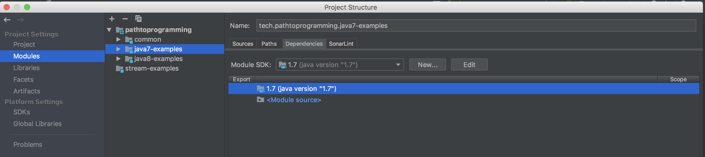
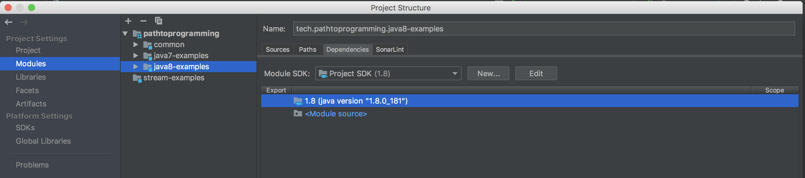

## Java 8 streams

This is a multi-module that uses jdk 7 & 8. Users of this repo can see clearly what features do not exist in Java 7. 
Examples are done in both modules to show different approaches to the same problem. A more detailed example involving 
an ArtistService is also included. This example demonstrates an easier way to iterate and manipulate collections of data 
using streams.

Requirements:

You need JDK 7 and 8 to run this project.
You must alter the module JDK versions in the project structure.

___

Resources:

[Java Optionals](https://www.baeldung.com/java-optional)

[Java 8 New Features](https://www.baeldung.com/java-8-new-features)

[Java One Liners Repo](https://github.com/aruld/java-oneliners/wiki)

[Functions Java Docs](https://docs.oracle.com/javase/8/docs/api/java/util/function/package-summary.html)

[Fork and Join in Java 7](https://www.baeldung.com/java-fork-join)